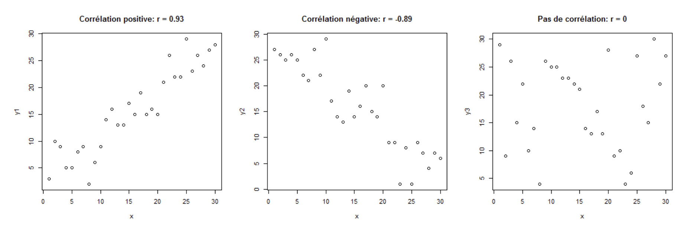

```{r setup, include=FALSE}
knitr::opts_chunk$set(echo = TRUE)
```

## Introduction

Le package DataExplorer est un package qui permet comme son nom l'indique, d'explorer les données issues d'un dataset. L'EDA ou Exploratary data analysis est une etape importante dans de nombreux projets de Data Science ou de Data Analyse. Cette etape permet de resumer les characteristiques d'un dataset, d'analyser les distributions des variables ou encore de visualiser de facon méthodique et minutieuse notre jeu de données. Le package DataExplorer nous permet alors de repondre à cette étape crucial.


## Installation du package

Pour cela rien de plus simple, il suffit d'ecrire les lignes de code ci-dessous:

```{r DataExplorer}
install.packages("DataExplorer",repos = "http://cran.us.r-project.org")
library(DataExplorer)
```

## Exemple sur un jeu de données


Pour bien comprendre ce package nous allons utiliser ce package sur un dataset que R nous fourni, en l'occurrence, iris, grace au packages Dataset. Ce fameux ensemble de données sur l'iris (de Fisher ou d'Anderson) donne les mesures en centimètres des variables longueur et largeur des sépales et longueur et largeur des pétales, respectivement, pour 50 fleurs de chacune des 3 espèces d'iris. Les espèces sont Iris setosa, versicolor et virginica. Nous allons visualiser ce Dataset puis utiliser notre package DataExplorer ensuite.

```{r}
library(datasets)

# Vue rapide dataset grace à la fonction head()
head(iris)
```

## Analyse du Dataset avec DataExplorer

### La fonction introduce() va nous permettre de connaitre la taille de notre jeu de données, le nombre de variables categorielles ou continues ou le nombre de valeurs manquantes 

```{r}
introduce(iris)
```

### La fonction plotstr() va nous permettre de voir la structure de notre dataset.

```{r}
plot_str(iris)
```

### Visualisons les frequences de distributions de chaque variable continue:

```{r}
plot_histogram(iris)
```

### Visualisons les frequences de distributions de chaque variable catégorielle (ici le nom des sepales):

```{r}
plot_bar(iris)
```

Tout le travail reside dans le fait d'explorer colonnes par colonnes afin de mieux s'appropier le dataset. On peut par exemple comprendre ici que la frequence des types d'especes de fleurs est toujours la meme (freqences de 50 pour les trois especes).

### Correlations entre les variables

Nous pouvons egalement grace à ce package analyser les correlations entre les variables à travers une heatmap.

* Petit rappel sur la correlation de Pearson:

Wikipedia: Le coefficient de Pearson est un indice reflétant une relation linéaire entre deux variables continues. Le coefficient de corrélation varie entre -1 et +1, 0 reflétant une relation nulle entre les deux variables, une valeur négative (corrélation négative) signifiant que lorsqu'une des variable augmente, l'autre diminue ; tandis qu'une valeur positive (corrélation positive) indique que les deux variables varient ensemble dans le même sens. *



Regardons à present les correlations entre nos variables. Attention il ne s'agit ici que de variables continues.

```{r}
plot_correlation((iris), maxcat = 5L)
```


### Les boites à moustaches

Les boites à moustaches, ou boxplots, permet de visualiser les distributions des donneés continues basés sur une variable.

Prenons ici l'exemple la distribtution des autres variables par rapport à la taille des petales (length sepal).

```{r}
sepal_df <- iris[, c("Sepal.Length","Sepal.Width", "Petal.Length", "Petal.Width")]

## Call boxplot function
plot_boxplot(sepal_df, by = "Sepal.Length")
```


### Scatterplots (Nuage de points)

Une autre facon de visualiser nos données est l'utilisation de la fonction plot_scatterplot(). Essayons de visualiser nos données continues sous la forme donc d'un nuage de points.

```{r}
sepal_df <- iris[, c("Sepal.Length","Sepal.Width", "Petal.Length", "Petal.Width")]

plot_scatterplot(sepal_df, by = "Sepal.Length",sampled_rows = 1000L)
```


## Conclusion

Le package DataExplorer nous permet donc de visualiser au mieux les differentes caracteriques de notre jeu de données. Il permet egalement de visualiser les valeurs manquantes, de supprimer des colonnes ou encore de regrouper des valeurs ensemble afin d'avoir moins de categories.

