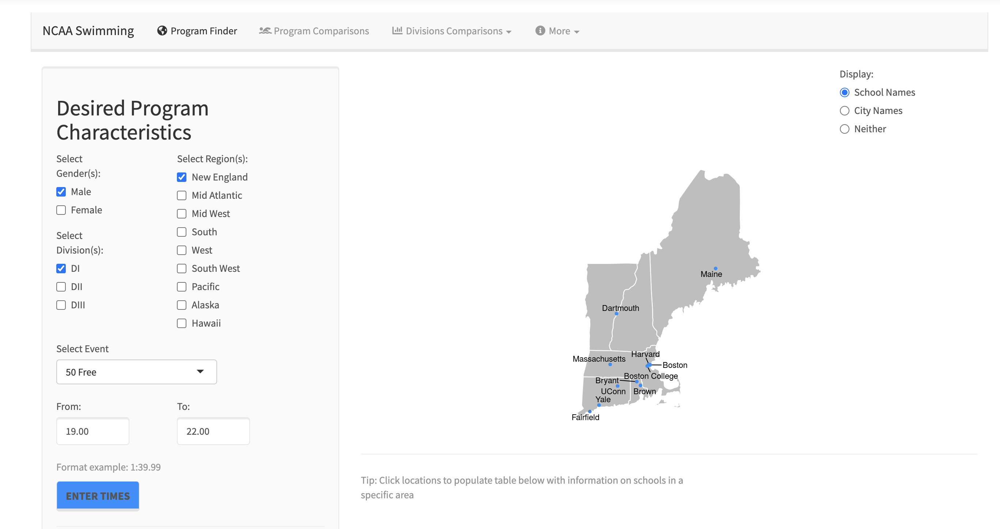

```{r setup, include=FALSE}
knitr::opts_chunk$set(echo = TRUE)
```

## Introduction 

Shiny est un package R integré R studio permettant la presentation d'analyses statistiques sous forme interactive d'un application web.
Il est donc possible de creer rapidement et sans trop d'efforts une plateforme permettant d'explorer dynamiquement nos données, d'y appliquer des modifications et d'obtenir un rendu attractif.

Voici un exemple d'application Shiny:





## Installation du package

```{r}
#install.packages('shiny')
library(shiny)
```

Une fois installée et chargée, il est necessaire de creer une applicationque l'on va s'approprier. Cette application est composé de deux fichiers ou variables à definir:

- ui.R
- server.R

Le premier (user interface) permet de controler la mise en page et l'apparrence de note application. On pourrait le comparer au CCS pour la création de page Web.

server.R contient les instructions dont l'ordinateur a besoin pour mettre en place l'application

## Modifier le theme de l'application

On peut personnaliser trés facilement le template de l'application en y appliquant des themes avec le package shinythemes que l'on doit installer et ensuite ajouter dans la partie serveur.

```{r}
#install.packages("shinythemes")
```

### Exemple d'application sur le dataset Iris

Pour bien comprendre ce package nous allons utiliser ce package sur un dataset que R nous fourni, en l'occurrence, iris grace au packages Dataset. Ce fameux ensemble de données sur l'iris (de Fisher ou d'Anderson) donne les mesures en centimètres des variables longueur et largeur des sépales et longueur et largeur des pétales, respectivement, pour 50 fleurs de chacune des 3 espèces d'iris. Les espèces sont Iris setosa, versicolor et virginica. Nous allons visualiser ce Dataset puis utiliser notre package Shiny sur la variable Sepal.Width


Nous allons ici tous mettre dans le meme fichier et decomposer ce fichier avec les variables ui et server.

Ici nous ecrivons la variable ui qui va donc nous permettre de gerer le titre et d'afficher un histogramme qui va s'adapter a la SideBar que l'utilisateur peut regler.

*Chaque ligne de code est commenté de facon à comprendre les differentes etapes de deploiements.*

```{r}

# Definir le UI
ui<-(fluidPage(
 
  # Application titre
  titlePanel("Ma premiere application Shiny"),
 
  # Sidebar qui va prendre en parametre le nombre de barre de l'histogramme
  sidebarLayout(
    sidebarPanel(
            helpText("Shiny est un package R intégré R studio permettant la presentation d'analyses statistiques sous forme interactive d'un application web.
Il est donc possible de creer rapidement et sans trop d'efforts une plateforme permettant d'explorer dynamiquement nos données, d'y appliquer des modifications et d'obtenir un rendu attractif."),
      sliderInput("bins",
                  "Nombre de barres:",
                  min = 5,
                  max = 50,
                  value = 30),
  # Texte qui va prendre en parametre le nom de l'espece choisi par l'utilisateur
      selectInput("var", 
                  label = "Choisir une variable",
                  choices = list("setosa",
                                 " versicolor",
                                 "virginica"),
                  selected = "Setosa"),
    ),
 
    # On regroupe ici nous differentes visualisations en fonction des parametres
    mainPanel(
      plotOutput("distPlot"),
      br(),
      textOutput("Espece_choisie"),
      
    )
  )
))
```


Nous allons à present nous occuper de la variable serveur qui va stocker le informations et les instructions dont l'ordinateur a besoin.


```{r}

server <- function(input, output) {
library(shinythemes)
library(datasets)

# Nous affichons en premier un histogramme 
    output$distPlot <- renderPlot({
#Récuperation de la deuxieme colonne de données de notre dataset
        Sepal.Width   <- iris[, 2]
        bins <- seq(min(Sepal.Width ), max(Sepal.Width ), length.out = input$bins + 1)

        hist(Sepal.Width , breaks = bins, col = 'red', border = 'black')
    })
#Ici, nous allons afficher l'espece choisi par l'utilisateur
    output$Espece_choisie <- renderText({
        paste("Vous avez choisi dans la liste le type de plante : ", input$var)
    })
}
```


Nous pouvons lancer notre application et la visualiser grace a la fonction ShinyApp().


```{r}
shinyApp(ui = ui, server = server)
```

L'utlisateur peut alors choisir par exemple de representer ces données sous de trés nombreuses formes et construire un dashboard dynamique qui lui permettra de selectionner les données qu'il considere essentielles.

Vous pouvez essayer de creer votre propre application grace au modele ci-dessus. Les possibités sont infinies.


## Deploiement de l'application

Une fois l'application terminé, on peut la partager sur internet directement. Pour cela trois possibilités:

- Passer par le serveur Shiny
- Passer par la plateforme « shinyapps.io » mise à disposition par RStudio
- Passer par RStudio Connect

Vous pouvez aussi simplement partager votre application simplement en envoyant le code .R a d'autres utilisateurs afin qu'ils utilisent votre application.


## Conclusion

La package Skiny est un package qui permet donc aux utilisateurs de R de creer leurs propre appilication et Dashboard et de permettre à un utilisateur de pouvoir regler cette application comme il le souhaite.
